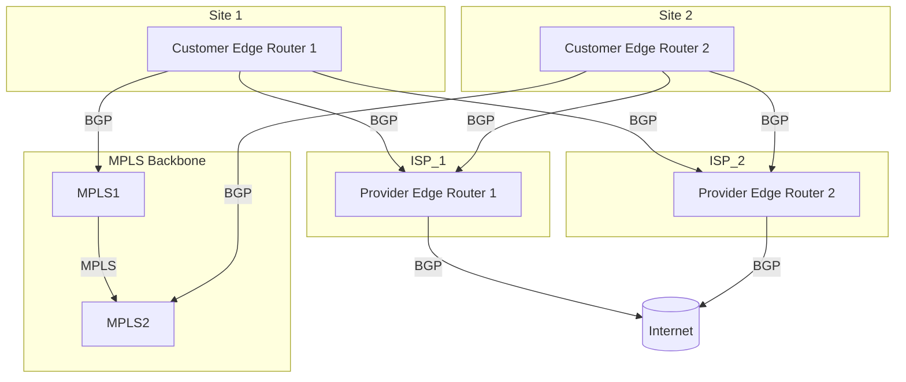

Here’s a detailed breakdown of your expertise with BGP, followed by a **Mermaid diagram** illustrating a scenario involving BGP in a multi-homed environment with MPLS integration:

### Scenario: Multi-Homed Environment with BGP and MPLS Integration

#### Overview:
In this scenario, you manage a network where multiple ISPs provide connectivity to ensure redundancy and load balancing. The network uses BGP to manage path selection, traffic engineering, and redundancy. Additionally, MPLS is used within the network for efficient traffic forwarding between different sites, ensuring high performance and reliability.

#### Components:
1. **Customer Edge Routers (CE1, CE2)**:
   - Located at different sites of the organization.
   - Connected to multiple ISPs for redundancy.
   - Running BGP to exchange routing information with ISPs.

2. **Provider Edge Routers (PE1, PE2)**:
   - Managed by ISPs, interfacing with the customer network.
   - Running BGP to handle routing between the customer’s network and the internet or other external networks.

3. **MPLS Backbone**:
   - Internal network managed by the organization, using MPLS to forward traffic efficiently between different sites.

4. **BGP Configuration**:
   - BGP is configured on both Customer Edge (CE) routers and Provider Edge (PE) routers.
   - Path selection and traffic engineering are managed via BGP attributes such as Local Preference, AS Path, and MED (Multi-Exit Discriminator).

5. **Redundancy and Load Balancing**:
   - BGP is used to ensure that if one ISP link fails, traffic is automatically rerouted through the other ISP.
   - Load balancing is achieved by configuring BGP to distribute traffic across multiple available paths.

### Mermaid Diagram:

### Explanation:
- **Customer Edge Routers (CE1, CE2)**: These routers are part of the organization's network at different sites. They connect to multiple ISPs and use BGP to advertise and learn routes.
  
- **MPLS Backbone**: The organization uses an MPLS network to efficiently route traffic between its sites (Site 1 and Site 2). The MPLS Backbone (MPLS1 and MPLS2) is connected to the Customer Edge Routers (CE1 and CE2), allowing for high-performance traffic forwarding.

- **Provider Edge Routers (PE1, PE2)**: These routers are managed by the ISPs and are responsible for routing traffic between the organization’s network and the broader internet or external networks.

- **BGP Connections**:
  - **Redundancy**: Both CE1 and CE2 connect to multiple ISPs via PE1 and PE2, ensuring that if one link fails, BGP will reroute the traffic through the other available link.
  - **Traffic Engineering**: You manage traffic distribution across the available paths using BGP attributes like Local Preference (for preferred paths), AS Path (for path selection), and MED (for routing decisions).

- **Internet Connectivity**: The Provider Edge Routers (PE1 and PE2) are connected to the internet, allowing the organization’s network to route traffic externally.

### Benefits:
- **Redundancy**: If one ISP or a link fails, BGP ensures traffic is automatically rerouted to the other ISP, maintaining network availability.
- **Load Balancing**: BGP's traffic engineering capabilities allow you to distribute traffic across multiple links, optimizing performance and ensuring efficient use of resources.
- **Scalability**: The integration of BGP with MPLS allows the network to scale easily as the organization grows, accommodating new sites and increasing traffic demands.

This diagram and explanation illustrate how you utilize BGP to manage a multi-homed environment with MPLS integration, ensuring robust, scalable, and efficient network operations.
