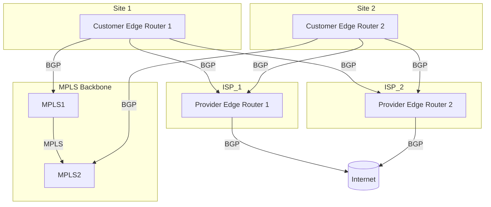

### Scenario: Multi-Homed Environment with BGP and MPLS Integration

#### Overview:
In this scenario, you manage a network where multiple ISPs provide connectivity to ensure redundancy and load balancing. The network uses BGP to manage path selection, traffic engineering, and redundancy. Additionally, MPLS is used within the network for efficient traffic forwarding between different sites, ensuring high performance and reliability.

#### Components:
1. **Customer Edge Routers (CE1, CE2)**:
   - Located at different sites of the organization.
   - Connected to multiple ISPs for redundancy.
   - Running BGP to exchange routing information with ISPs.

2. **Provider Edge Routers (PE1, PE2)**:
   - Managed by ISPs, interfacing with the customer network.
   - Running BGP to handle routing between the customer’s network and the internet or other external networks.

3. **MPLS Backbone**:
   - Internal network managed by the organization, using MPLS to forward traffic efficiently between different sites.

4. **BGP Configuration**:
   - BGP is configured on both Customer Edge (CE) routers and Provider Edge (PE) routers.
   - Path selection and traffic engineering are managed via BGP attributes such as Local Preference, AS Path, and MED (Multi-Exit Discriminator).

5. **Redundancy and Load Balancing**:
   - BGP is used to ensure that if one ISP link fails, traffic is automatically rerouted through the other ISP.
   - Load balancing is achieved by configuring BGP to distribute traffic across multiple available paths.

### Mermaid Diagram:



### Explanation:
- **Customer Edge Routers (CE1, CE2)**: These routers are part of the organization's network at different sites. They connect to multiple ISPs and use BGP to advertise and learn routes.
  
- **MPLS Backbone**: The organization uses an MPLS network to efficiently route traffic between its sites (Site 1 and Site 2). The MPLS Backbone (MPLS1 and MPLS2) is connected to the Customer Edge Routers (CE1 and CE2), allowing for high-performance traffic forwarding.

- **Provider Edge Routers (PE1, PE2)**: These routers are managed by the ISPs and are responsible for routing traffic between the organization’s network and the broader internet or external networks.

- **BGP Connections**:
  - **Redundancy**: Both CE1 and CE2 connect to multiple ISPs via PE1 and PE2, ensuring that if one link fails, BGP will reroute the traffic through the other available link.
  - **Traffic Engineering**: You manage traffic distribution across the available paths using BGP attributes like Local Preference (for preferred paths), AS Path (for path selection), and MED (for routing decisions).

- **Internet Connectivity**: The Provider Edge Routers (PE1 and PE2) are connected to the internet, allowing the organization’s network to route traffic externally.

### Benefits:
- **Redundancy**: If one ISP or a link fails, BGP ensures traffic is automatically rerouted to the other ISP, maintaining network availability.
- **Load Balancing**: BGP's traffic engineering capabilities allow you to distribute traffic across multiple links, optimizing performance and ensuring efficient use of resources.
- **Scalability**: The integration of BGP with MPLS allows the network to scale easily as the organization grows, accommodating new sites and increasing traffic demands.

Here’s a detailed Mermaid diagram illustrating a multi-area OSPF configuration that includes area design, route summarization, and both IPv4 and IPv6 environments: 

```mermaid
graph TB
    subgraph OSPF Backbone Area 0
        R1[R1: ABR] --> |LSA Type 1| R2[R2: Internal Router]
        R2 --> |LSA Type 1| R3[R3: Internal Router]
    end
    
    subgraph OSPF Area 1
        R1 --> |LSA Type 3 (Summary)| R4[R4: Internal Router]
        R4 --> |LSA Type 1| R5[R5: Internal Router]
        R5 --> |LSA Type 1| R6[R6: Internal Router]
    end
    
    subgraph OSPF Area 2
        R1 --> |LSA Type 3 (Summary)| R7[R7: Internal Router]
        R7 --> |LSA Type 1| R8[R8: Internal Router]
        R8 --> |LSA Type 1| R9[R9: Internal Router]
    end
    
    subgraph OSPF Area 3 (Stub)
        R3 --> |LSA Type 3 (Default)| R10[R10: Internal Router]
        R10 --> |LSA Type 1| R11[R11: Internal Router]
    end
    
    subgraph OSPF Area 4 (IPv6)
        R2 --> |LSA Type 3 (Summary)| R12[R12: Internal Router]
        R12 --> |LSA Type 1| R13[R13: Internal Router]
    end
    
    R1 --> |Route Summarization| R0[Internet Gateway]
```

### Explanation:
- **OSPF Backbone Area 0**: 
  - **R1** is the Area Border Router (ABR) that connects multiple OSPF areas.
  - **R2** and **R3** are internal routers within Area 0, exchanging LSA Type 1 messages (Router LSAs) to share information about their directly connected networks.

- **OSPF Area 1**:
  - **R1** also serves as the ABR for Area 1, summarizing routes (LSA Type 3) before advertising them into Area 0.
  - **R4**, **R5**, and **R6** are internal routers within Area 1, exchanging LSA Type 1 messages.
  - The design of Area 1 focuses on keeping the area self-contained, with summarized routes minimizing the size of the routing table.

- **OSPF Area 2**:
  - Similar to Area 1, **R1** acts as the ABR for Area 2, handling route summarization before sending updates into the backbone.
  - **R7**, **R8**, and **R9** are internal routers within Area 2, focusing on efficient routing within this area.

- **OSPF Area 3 (Stub Area)**:
  - **R3** is configured as an ABR for Area 3, a stub area that receives a default route (LSA Type 3) rather than the entire routing table from the backbone.
  - This configuration is useful for reducing the routing overhead in areas that don’t require full route knowledge.

- **OSPF Area 4 (IPv6)**:
  - **R2** is the ABR connecting the IPv6-enabled Area 4 to the OSPF backbone.
  - **R12** and **R13** manage routing within Area 4 using IPv6 addresses and OSPFv3, which supports both IPv4 and IPv6.
  - LSA Type 1 and Type 3 are used here to propagate IPv6 routes.

- **Route Summarization**:
  - The diagram shows **R1** performing route summarization before advertising routes to an external **Internet Gateway** (R0). This reduces the number of routes that need to be advertised outside the OSPF domain, optimizing performance and reducing routing table size.

### Key Concepts:
- **ABR (Area Border Router)**: A router that connects one or more OSPF areas to the backbone area (Area 0). It manages the exchange of routing information between these areas.
- **LSA Types**:
  - **Type 1 (Router LSA)**: Advertised by every router within an area to describe its directly connected networks.
  - **Type 3 (Summary LSA)**: Used by ABRs to advertise summarized routes between different OSPF areas.
- **Stub Area**: An OSPF area that does not receive external routes (from outside the OSPF domain) but instead relies on a default route.
- **IPv6 (OSPFv3)**: The latest version of OSPF that supports both IPv4 and IPv6 networks, ensuring compatibility with modern networking environments.

This diagram captures the complexity of multi-area OSPF configurations, illustrating how OSPF can be tuned and optimized for different network environments, including those involving IPv6.
